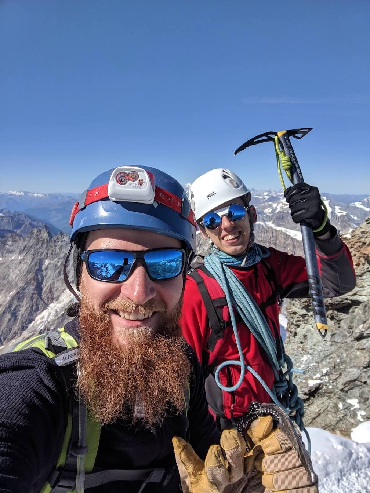
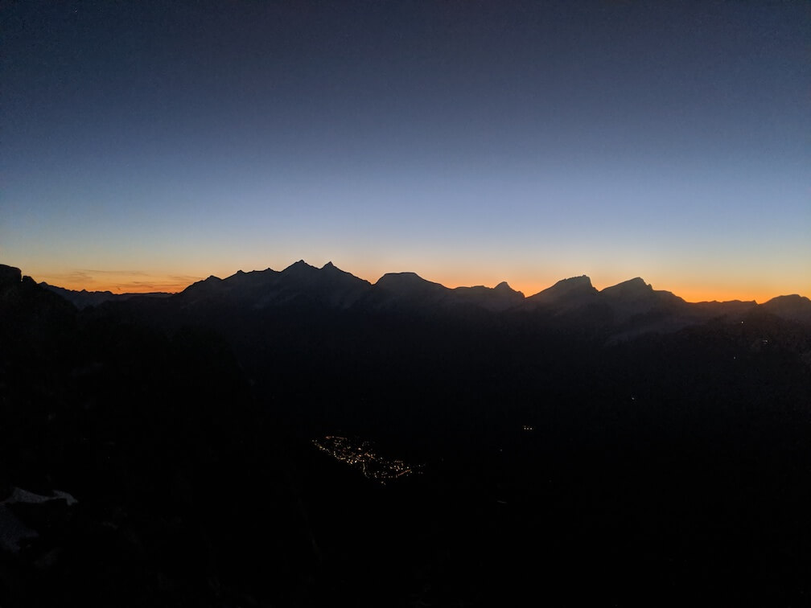

Project Matterhorn

Matterhorn - one of the highest mountains in the Alps and probably the most iconic mountain in the whole world. Two years ago I saw it for the first time and was astonished by its majesty, I didn't even think about ever climbing it, it would sound crazy and ridiculous.

_Matterhorn mountain (4478 m.)_

Since last year I've been seriously hooked up by climbing and all the perks it brings for my personal growth. And then one month ago Ignas randomly told me "Hey, it may sound crazy, but what do you think about climbing Matterhorn?" I just almost without any hesitation said "Fuck, that is crazy indeed! Let's do it!". Oh, and by the way, the season was coming to an end, so we should do it in a month or wait for the next year. "Of course, let's do it this season!". A few days after that we bought plane tickets and started preparation to make this dream come true.

The idea to climb it was scary and we didn't really know what to expect, but both of us were too psyched about this idea so we just started preparing. Month had passed very quickly, did a lot of climbing in the gym, cycling, roller skating, simulating hikes in Lithuanian forests, I even started to practice yoga almost daily. Moreover we did one weekend trip to the Tatra mountains for Krivan peak to become as much prepared physically as possible. We also had to learn lots of alpine climbing techniques, how to become rope jedi, how to prepare for bad weather conditions, how to use crampons, ice axes, how to acclimatize properly and many other exciting alpine survival stuff. In a month a scary dream became quite a confident feeling that we actually are going to make it real.

And so the journey started. Our initial plan was to make three climbs: one easy ascent for the beginning to get used to the rocks and overall feeling, then acclimatise by hiking at high altitude over the glacier and then wait for the good weather to assault the Matterhorn.

It was snowing a bit on the first day, but the weather was still good enough to play around a bit, so we decided to stick to the plan and take the Riffelhorn peak. The ascent was relatively easy, but it was a very good playground to climb around, get used to new gear, get some confidence climbing together and just enjoy the magnificent view of the Alps.

_Rappelling from Riffelhorn peak (2927 m.)_

Another day had come and this time we prepared more seriously for a two day glacier experience and we headed to the cable car. It took us way up to a 3800m altitude. From the very beginning the view of the icy deserts was astonishing. It was crazy to think that I'm actually going to pass over it, climb peaks here and even stay overnight, because I am not really a big fan of cold weather. But the idea to face the fear of cold and make it more controllable was fair enough to take that challenge on!

We roped up, put our crampons and headed for the adventure through the snowy desert to climb the Pollux and Castor peaks. Blindingly bright snow reflecting the Sun, voracious crevasses, cracking ice sounds over the valley and overall exposure of the Alps can't leave you without an impression. It's at the same time heavenly beautiful and dangerous as hell. A few hours walking through this paradise passed very quickly and we reached the Pollux mountain and started ascending it. There we felt very clearly that it's way harder to do high intensity activities without proper acclimatisation. It was my first experience climbing with crampons and an ice axe, at first it was quite unstable, but after some time I got used to it and enjoyed the ascent.

_Alps glacier with Breithorn mountain range._

Climbing Pollux took us longer than expected so we decided to skip Castor peak and go straight to Ayas hut - two more hours hiking through the glacier. Before the sunset, we arrived at our place of stay for the night, tired but happy. Sleeping at 3420m elevation was a bit unusual, felt light headache and surprisingly it was quite hot in there. Overall, got quite a good sleep and was ready for the next day’s adventure!

The next day in the morning weather looked good, just a little cloudy so we decided to go for Castor and then maybe even take another peak - Breithorn. But after some hours of walking nature decided to play around with us :) Approximately 15m/s wind started to blow and cloudy sky became a complete whiteout where you can see only 5-10 meters around yourself. It was interesting to observe myself in those extreme conditions, my mind becomes much more sharp and focused, without any irrelevant thoughts I scan my body and make the right decisions to move as efficient and comfortable as possible. The walk itself after the night at high altitude became much easier, the organism adapted to decreased oxygen levels very well. So it basically became a meditation, just calmly walk through the nothingness, concentrate only on the present moment and fix any uncomfortable feelings that arise. We obviously skipped those peaks we planned to ascend that day, was too dangerous and 5-6 hours hike with those weather conditions was good enough to feel the power of pure wild nature.

Even though we already had experienced enough to be proud of this journey, the biggest challenge was waiting ahead. After analysing weather forecasts and our current condition we decided to take one rest day and then go for our main goal, the Matterhorn. Many lessons were learnt during our preparation hikes. One of them may sound ridiculous, but it's a really a bad idea to ignore the sunscreen on a glacier when you can't even see the Sun. The fog around you and the snow reflects sunbeams in all directions and you are basically walking in an overpowered natural solarium! Another one is how dangerous it would be to walk on the glacier alone. Never do that! Crevasses are very dangerous and you would never know when another one would open just below your feet. In fact, even though we were walking on a settled path, Ignas, as a leader of our group of two (one who walks first), fell into a crevasse twice! Nothing serious happened, only fell up to his torso, but it still shows the risk of those beautiful silent killers.

_One of the biggest crevasse we encountered. Their depth can reach up to 140 meters._

And so the day had come to approach the Swiss legend. The plan was to take a cable car to 2583m height, hike up to Hornli hut at 3260m, stay there overnight and in the early morning assault the Matterhorn peak (4478m) and come back to cable car by 17:00. Everything had started just perfectly. Despite the ending of the summer climbing season the weather was perfect for climbing the Matterhorn, there weren’t any clouds, the Sun was shining, the temperature wasn’t too cold and our body condition was at its peak after a good rest day. First day we approached Hornli hut in no time, we arrived even faster than planned, settled down there and decided to warm up a bit and try first 1-2 hours of the climb that is waiting for tomorrow.

It was so exciting to approach the first steps of the climb and realise that you are at that point where you no longer can change anything too much. We did everything we could to prepare for this and now it's time to test out are those countless hours spent will pay off or will you have to retreat and come back again next year stronger and wiser. That test run of a few hours added even more confidence for us. The rock seemed solid and fun to climb, body worked as a Swiss watch, simul climbing technique was quite comfortable even though we had never tried it before. The only bigger concern was path finding. It was quite hard to find the right path and not get into too steep climb section or step onto loose rocks. But there will be more climbers trying to conquer the Matterhorn tomorrow, mostly with the guides, so that problem seemed to be easily solvable by following someone on the go. Overloaded with tons of positive emotions we headed back to the hut, spoke some rubbish with other roommates that were going to take the same challenge and went to get some sleep before the final countdown.

There are some quite strict rules climbing Matterhorn from the hut. You can't just randomly ascend it whenever you want, there is a defined time when you can start and at the end of the season it was quite late - earliest time was at 4:50. Also one more rule - groups with Swiss guides go first, then groups with other country guides and individual groups go last. Those rules make sense to ensure the efficient and safe climb for everyone, but that definitely didn't help us achieve our initial plan and it was quite obvious that we will not make it until 17:00 o'clock to the cable car. But there were other option like to stay at the hut for one more night or just descend way back to Zermatt (1608m) which is kind of hardcore, but doable, so we weren’t bothered about that too much.

We woke up at 4:20, had breakfast, prepared all gear needed and headed to the start of the climb. We knew that there will be a small jam at the beginning because there were around 20 other groups climbing, mostly with guides and the first section is steep and slow with fixed ropes, so we were not in a big rush as we will still climb last. Standing in a queue for the climb was a bit nervous, many random thoughts came to my mind, but as soon as we started to climb everything just vanished. I love so much that feeling of focus and clarity of what to do next while climbing. It is so awesome when your body, mind and feelings supplement each other and all contribute to the same goal.

_Shadow of the Matterhorn._

Our pace was super fast, we ran through the first half of the climb in no time beating all our expectations. Following rushing guides with their clients and random roommates shouting "Go, go, room number 12!!!" surely helps to keep the motivation up and not give up when it gets harder. We did a small rest by the emergency Solvay hut (4000m), enjoyed a stunning view of the landscape and made ourselves ready for the final vertical meters of the climb. This part was much steeper, more difficult technically and we already felt a bit tired after such an intense climb. Our pace slowed down a little, we dropped behind a bit from the main group we were following and that's the point where things get a bit more interesting :)

"Rock!!!" - never heard Ignas shouting this word so seriously. We often encounter small falling rocks while rock climbing, but most of them are not significant to worry about and would give you a bruise on contact at most, despite this fact, it's still a good habit to warn everyone about incoming dangers. But that one was from a different league. One that could easily wipe off few people at once! Gladly it passed by me and another group that was climbing behind us and everyone stayed safe. That was a good indicator that we should be extremely careful with our chosen path as rocks are very fragile even a few meters off the main track and that could be fatal not only for us, but for others as well.

A little bit shocked but determined to finish our challenge we proceeded with our climb more carefully. Terrain was getting steeper and steeper. We approached one of the last sections of the climb - fixed ropes. There were almost vertical rock walls with massive ropes attached to them. The section itself was quite long and some groups were already descending the mountain so it gets more difficult to proceed fast, but there was enough time to realise what is happening and just to look around. So much was clearly visible at once - the whole ridge that we had climbed, Hornli hut where we stayed last night and even Zermatt village. It's truly amazing to realise that so much of the climb was already in the past and we are almost on the top. But from the other side we knew that hardest part awaits ahead - the last section of a snowy 50 degree slab and then a descent, way back from the mountain which usually takes longer than the ascent.

Rope by rope we approached the last section which at least for me was the scariest part of the climb. Basically you have only crampons and an ice axe to hold on to, rocks - which was the main holding point the whole route, here were rarely visible. One uncertain movement, one slipped ice axe and you are sliding down the slope. Of course, we used our rope for safety purposes, but you would still slide 10-20 meters down on an inaccurate move. I was impressed how determined and certain Ignas was on this last part of the climb. That attitude of him for sure helped me as well to get my shit together and just work for our goal which was that close.

The summit! Finally we did it! Walking through top ridge felt like walking on a podium after winning some grand competition. And the award was the best I could have ever imagined - the landscape of the whole Alps. Switzerland on one side, Italy on the other and you are walking on a tiny edge of this mesmerising exposure. We stayed there for a while, was so good to be on the top, forgetting about everything and just experiencing those overfilled emotions. It might be that we relaxed a bit too much. Yes, goal was already reached, but the real challenge had only just begun :)

_Matterhorn summit (4478 m.). Excited and happy!_

Down climbing is very easy on sport climbing routes, you just tie up to the anchor and rappel straight down. On a Matterhorn it's trickier, firstly you need to find the right direction, because you want to end up at the next safe position to rappel from. The other point - if you want to be on a safety all the time, you need to tie up to anchors every 15 meters. It takes huge amount of time to deal with the rope so often. Most of the guides just belay their clients and climbs without any safety just to go much faster. From the very start, we decided that we don't need to rush for the cable car, because even at the best pace we would not make it and it's not worth the risk to go yolo mode, so we tried to do everything as safely as possible.

But that was reaaaaly slow... We climbed one fourth of the route for more than 3 hours. It was a bit scary to realise, but at that pace we would be near Hornli after midnight at best! Then we increased our tempo a bit and climbed easier parts just using simul climbing technique. But that was not enough, we were too tired to climb faster or take even more risk. It's so important in such situations not to take impulsive decisions, calmly weigh up every possible solution and pick the one that suits the best at the current moment. First of all, we decided to see how long it will take us to climb to Solvay hut. From time perspective it is halfway down, so it will be easier to plan ahead from there.

We were at Solvay hut at 18:00 and there was still 5-6 hours of climbing left. Climbing down would mean that we will be climbing for 3-4 hours in complete darkness. Considering the fact that path finding is very hard even when everything is clearly visible, in the darkness it would be extremely dangerous. The other option was to call for a helicopter and fly around a bit, which would be quite a nice experience, but as it turned out very expensive. We even investigated into helicopter prices and our insurance conditions while being on the mountain. But those were not on our side, we would need to get an injury first to get compensation :) And the third option was to stay for the night at the Solvay hut. We were not prepared for that at all. We went for the climb as light as possible, took water and food only for the planned amount of time and of course didn't take extra clothes. So, the time has come to choose our destiny.

_Whole ridge of the Matterhorn. Everything looks so close, but yet so far..._

Surprisingly, we were not the only ones who underestimated the power of this mighty mountain. When we were struggling with our decision at the Solvay hut, a few more people descended to us - 4 French guys and one solo Ukrainian climber Dima. Some of the French guys looked very frustrated and nervous. Can't disagree with them, it was really tough to decide what to do at this point. After taking some rest and talking something in French they decided to down climb at night. On the other hand, Dima was a bit more relaxed guy and he already knew beforehand that he might not finish this mountain in one day, so he was determined to stay at the hut and without too much struggle started to settle down there. We almost immediately rejected the idea to climb down at night as it was too dangerous. Helicopter idea was too exotic and would be necessary only in an extreme emergency. So with quite good inspiration from Dima, decision was quite obvious - we are staying in this wooden shack on the edge of the abyss!

For me it was quite ironic, one of the biggest fears that I have is the fear of cold and now I get an inevitable challenge to face it straight by sleeping at below zero temperature with a limited amount of clothing. But I felt ready for it. As it turned out there were exactly 3 sleeping spots with mattresses and some old blankets which was really helpful. We started to prepare our dwelling for a night, shared together the leftovers of our food, Dima had a Primus, so we were able to make warm water by melting the snow. Everything was so minimalistic, but practically we had everything to fulfil our needs.

After a bit of time we decided to check out how it is going for our French friends of misery. We were able to clearly see the whole ridge that leads to the very bottom. It was really scary to see them being still so high while the Sun was already hiding over the Alps massif. Moreover, we suddenly spotted some strange thing rolling down the face of the mountain. It was one of those guys’ backpacks. No idea how and why that happened, but that was really a pity to observe that backpack rolling down for like 2-3 minutes. All those circumstances most likely hit very hard over their morale. After some more time, when it was already dark we heard a helicopter coming. It was coming for our French guys. We hoped that none of them were injured and everything ended well for them.

We spent the rest of our evening cosy snacking and chatting with Dima. He is a regular worker from Ukraine that doesn't have much money, but his passion for climbing and embracing challenges is so high that not even extreme Swiss prices could stop him! Hitchhiking, sleeping in a tent at random places, carrying food supplies from his home country to save even more, traveling completely alone, but kindly reaching a helping hand if anyone needs it along his path. A true hero! And we were more than happy that our paths were meant to cross.

The night was cold, but not as bad as I thought it would be. Probably my expectations and of course warm drinks helped me prepare for this night pretty well. I can call myself a pretty patient person, so my initial plan for the night was just to wait for the morning Sun with no frozen limbs of my body without really expecting to fall asleep. But as it turned out, it was totally possible to sleep there and I only woke up every 1-2 hours to cover most frozen parts, check the clock and prepare for more sleep. Funny notice that every time I woke up, before looking at the clock, I made a prediction about how much time it is right now and all the time I was around half an hour behind. Small thing, but it helped a bit to keep my mind calm, because time goes faster than I perceive it!

_Sunrise from Solvay hut (4000 m.). Zermatt village lights on the bottom._

Suddenly I heard some sounds coming from the other side of the hut walls. Yup, that was the first conquerors of the Matterhorn that day. One group opened the door of the hut, saw that there are sleeping folks and decided to not disturb us, then some more groups did the same. It was quite an obvious spot to make a rest point ascending the mountain so I clearly heard them outside, but could not understand a word in Deutsch. It was a good point to start stretching stiff body parts and going out of the bed. We all woke up more or less at the same time. Surprisingly we were able to rest pretty well over the night and prepared to finish our adventure with grace. Passing groups saw that no one is sleeping anymore so they more willingly were entering the hut. There we met one funny guy from Slovenia who was going solo up the mountain. He was very interested in our story, we could not lie to him and told all the truth what happened to us yesterday. As it appeared it was not a very motivating story for conquering the Matterhorn so he decided to join us going down :)

Four of us started to descend the mountain. First parts of the climb from the hut were quite steep and we had plenty of time, so we started to climb safe and slow. Slovenian guy had 80 meter rope, which was way too much for that mountain, because it is heavy and hard to manage, but at the current moment while descending it was very helpful, because we were able to rappel 40 meters down at once. Ignas, our rope master, was preparing rappel stations, searching for the next good safe points, all of us were going down by a prepared rope, coiling the rope and repeating that process all over again. As it was already approved, the hardest part was path finding, but we were not in a rush and were enjoying the last hours of this adventure exploring the rocks here and there. It was way more fun to move in a group of four, especially with such a positive and loving to throw jokes around Slovenian guy whose name we forgot to ask :)

The second part of the climb was way easier and not that dangerous so we were climbing faster, without the ropes, sometimes catching guides to follow and not to lose the track. It took us around 5 hours to climb from the Solvay hut to Hornli hut. No way we would have done that yesterday at night, it was such a good decision to stay on the mountain. Happy that everything was already in the past we headed to the hut to relax a bit, take our excess items that we had left here the day before and head back to a cable car.

So much was experienced during those days both physically and emotionally. For some days after this trip I didn’t want to think of any big next adventures, mountains or future trips. All I wanted is to calmly rethink what had just happened, realise, structurise and absorb every lesson learnt during this tremendous adventure. Adventures that push you to go far out of your comfort zone and force you to try much harder than you used to may look very frustrating, uncomfortable, painful or mind breaking and might look not worth the effort. But believe me, with the right attitude that’s the main force that drives you through life and empowers you to improve yourself in any direction you are willing. Don’t feed your fear and don’t let it become bigger than you, strive to understand it and let it come along like a best friend.
